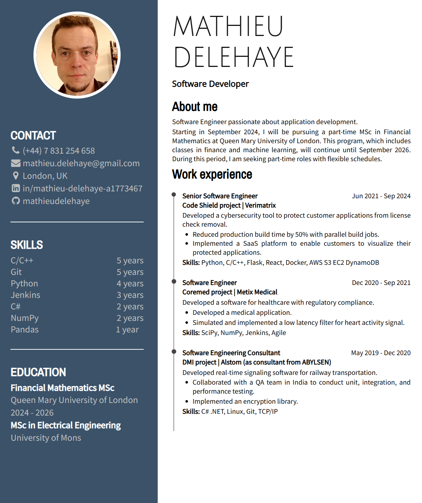

# MyResume

Visit my resume website: https://mathieudelehaye.github.io/MyResume/ 

<p float="left">
  
</p>

<p float="left">
  
</p>

Start backend:

## How-to guide

```powershell
node .\server.js
```
